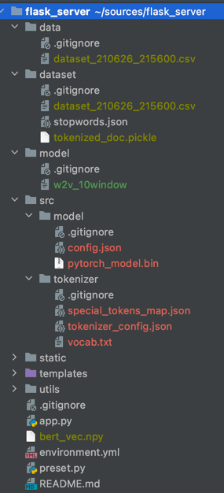

# Perfume Recommendation from Fragrantica

## 개발 환경

- python 3.7
- conda 4.10.1

## 초기 설정 방법

### 의존성 설치

[링크참고](https://conda.io/projects/conda/en/latest/user-guide/tasks/manage-environments.html#creating-an-environment-from-an-environment-yml-file)

environments.yml 을 이용해 해당 conda 환경에 requirements 를 설치한다.

```shell
conda env create -f environment.yml
conda activate perfume_recommendation
```

이후 개발중에 requirements 를 추가하게 되면 아래의 command 를 통해 `environment.yml` 에 반영하도록 한다.

```shell
conda env export > environment.yml
```

### Dataset 및 모델 다운로드

<https://www.notion.so/sejongai/Dataset-ff4e5acfdf6f444cb2d4d4d892665560>

위의 링크에서 `dataset_210626_215600.csv` 을 다운받아 `/data` 에 배치한다.

<https://drive.google.com/drive/folders/1-V_yRIoQH9C-2iuA7L7F_KeUd1vQ67EA>

위의 링크를 폴더 째로 다운받아서 `src/model` 에 위치시킨다.

<https://drive.google.com/drive/folders/1-5fk-xSCmLJE8SWkt7rI_mxhM2AlDQl8>

위의 링크를 폴더 째로 다운받아서 `src/tokenizer` 에 위치시킨다.

<https://www.notion.so/sejongai/recommend-cc741512dd1f43fd980c88b530c47344>

위의 링크에서 w2v 관련 모델 및 dataset 다운로드 및 배치

아래 그림을 참고해서 dataset 과 모델을 위치시킨다.

